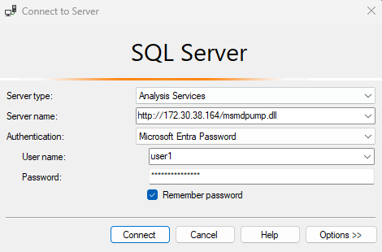

## SQL Server Analysis Services Image

This image contains an installation of Analysis Services, exposed through IIS.

[Configure HTTP Access to Analysis Services on IIS 8.0 | Microsoft Learn](https://learn.microsoft.com/en-us/analysis-services/instances/configure-http-access-to-analysis-services-on-iis-8-0?view=asallproducts-allversions)

Because Analysis Services only allows Windows Authentication, you need to create local users to access it. 

These are the minimum ENV variables needed to run this image:

```yaml
# Create users automatically when starting the container, in the format user:pwd,user2:pwd2,...,usern:pwdn
SSAS_USERS=user1:8r69s6ZGJKNBeGA

# Ensure the service starts when the container does
SBS_SRVENSURE=MSSQLServerOLAPService
```

Once setup, you can connect using Management Studio and Microsoft Entra Password



