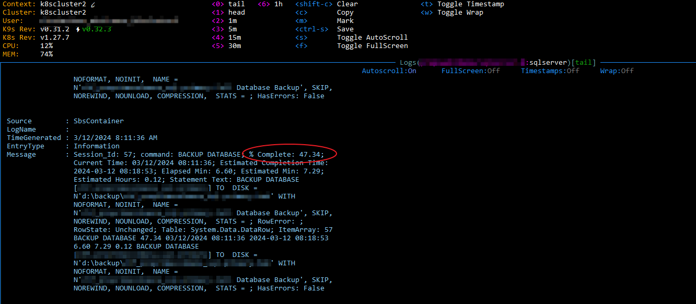
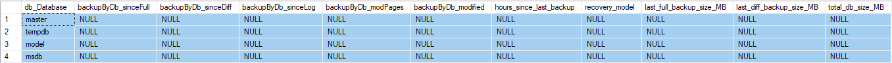
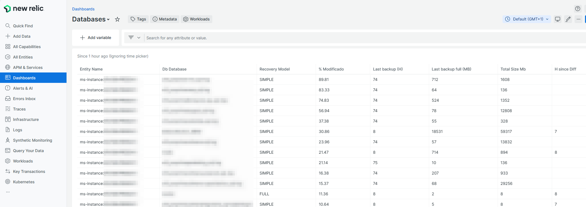

# Microsoft SQL Server 2022 base image - For Kubernetes

## Instance Startup Configuration

Use MSSQL_SPCONFIGURE to run SPCONFIGURE on boot, if any of the changes requires a restart, the script will detect it and take care of it.

```yaml
MSSQL_SPCONFIGURE=max degree of parallelism:1;backup compression default:1
```

## Backup and Maintenance

The image comes with a well known backup solution already installed:

[SQL Server Backup (hallengren.com)](https://ola.hallengren.com/sql-server-backup.html)

It includes the following SQL Server Agent jobs:

| Job Name                 | Purpose                                                      | Recommended Schedule                                         |
| ------------------------ | ------------------------------------------------------------ | ------------------------------------------------------------ |
| CommandLog Cleanup       | Clean logs                                                   | Weekly                                                       |
| Mssql - Reset memory     | Release memory usage by temporarily downgrading server max memory according to environment MSSQL_BACKUP_RELEASEMEMORY | Use with caution when server is as close as possible to idle usage |
| MssqlBackup - CLEAN      | Cleanup backups according to env: MSSQL_BACKUP_CLEANUPTIME_LOG, MSSQL_BACKUP_CLEANUPTIME_DIFF and MSSQL_BACKUP_CLEANUPTIME_FULL. Only used when backing up to Azure Blob Storage through MSSQL_PATH_BACKUPURL | Ideally run right after DIFF and FULL                        |
| MssqlBackup - DIFF       | Differential backup for user databases                       | According to required RPO and RDP                            |
| MssqlBackup - FULL       | Full backup for user databases                               | According to required RPO and RDP                            |
| MssqlBackup - LOG        | Log backup for user databases                                | According to required RPO and RDP                            |
| MssqlBackup - LTS AzCopy | Copy DIFF and Full backups to an alternate Azure Blob, that can support immutable storage. Uses MSSQL_BACKUP_AZCOPYLTS as target and MSSQL_PATH_BACKUPURL as source. Uses AzCopy so the copy is blob-to-blob, consuming no server resources and is extremely fast. | Every 1 hour.                                                |
| MssqlBackup - SYSTEM     | Full backup for system databases                             | According to required RPO and RDP                            |

You can schedule these tasks using environment variables:

```yaml
- 'MSSQL_JOB_Full={"Job":"MssqlBackup - FULL", "Enabled": true, "Schedules": [{"Schedule": "Full weekly", "FrequencyType": "Weekly", "FrequencyInterval": "Saturday", "FrequencySubdayType": "Once", "StartTime": "230000"}]}'
      - 'MSSQL_JOB_Log={"Job":"MssqlBackup - LOG", "Enabled": true, "Schedules": [{"Schedule": "Every 5 minutes", "FrequencyType": "Daily", "FrequencyInterval": "EveryDay", "StartTime": "000000", "EndTime": "235959", "FrequencySubdayType": "Minutes", "FrequencySubdayInterval": 5}]}'
      - 'MSSQL_JOB_Diff={"Job":"MssqlBackup - DIFF", "Enabled": true, "Schedules": [{"Schedule": "Daily", "FrequencyType": "Daily", "FrequencyInterval": "EveryDay", "StartTime": "230000"}]}'
      - 'MSSQL_JOB_CommandLogCleanup={"Job":"CommandLog Cleanup", "Enabled": true, "Schedules": [{"Schedule": "Full weekly", "FrequencyType": "Weekly", "FrequencyInterval": "Friday", "FrequencySubdayType": "Once", "StartTime": "220000"}]}'
      - 'MSSQL_JOB_MssqlCleanBackups={"Job":"MssqlBackup - CLEAN", "Enabled": true, "Schedules": [{"Schedule": "Every 6 hours", "FrequencyType": "Daily", "FrequencyInterval": "EveryDay", "StartTime": "000000", "EndTime": "235959", "FrequencySubdayType": "Hours", "FrequencySubdayInterval": 6}]}'
      - 'MSSQL_JOB_LtsAzCopy={"Job":"MssqlBackup - LTS AzCopy", "Enabled": true, "Schedules": [{"Schedule": "Every 2 hours", "FrequencyType": "Daily", "FrequencyInterval": "EveryDay", "StartTime": "000000", "EndTime": "235959", "FrequencySubdayType": "Hours", "FrequencySubdayInterval": 2}]}'
      - 'MSSQL_JOB_DeleteBackupHistory={"Job":"sp_delete_backuphistory", "Enabled": true, "Schedules": [{"Schedule": "Daily", "FrequencyType": "Daily", "FrequencyInterval": "EveryDay", "StartTime": "190000"}]}'
      - 'MSSQL_JOB_PurgeJobHistory={"Job":"sp_purge_jobhistory", "Enabled": true, "Schedules": [{"Schedule": "Daily", "FrequencyType": "Daily", "FrequencyInterval": "EveryDay", "StartTime": "200000"}]}'
      - 'MSSQL_JOB_OutputFileCleanup={"Job":"Output File Cleanup", "Enabled": true, "Schedules": [{"Schedule": "Full weekly", "FrequencyType": "Weekly", "FrequencyInterval": "Thursday", "FrequencySubdayType": "Once", "StartTime": "220000"}]}'
```

The general structure of a Job Schedule configuration using environment is (supports YAML)

```yaml
# Root object is passed down to Set-DbaAgentJob, except for the SCHEDULES array (see their docs for available options)

# Name of the job, must exist in the container
Job: sp_purge_jobhistory
Enabled: true
# List of schedules for the JOB. The schedule definition is passed to Set-DbaAgentSchedule (see their docs for available options)
Schedules:
- Schedule: Daily
  FrequencyType: Daily
  FrequencyInterval: EveryDay
  StartTime: '200000'
```

You can define backup cleanup times for each type of backup (retention). If you are using Backup To Url (Azure Blob SAS) the image contains custom logic to deal with cleanup, compensating for the lack of support for CleanupTime in the native Hallengren backup solution, the code for this cleanup code is [here](setup/backups/assets/Program Files/WindowsPowershell/Modules/Sbs/Functions/SbsMssqlCleanupBackups.ps1). Note, like the original backup solution, the cleanup logic ensure that a **viable full restore can be made** and that **no restore chain is affected** , even if you misconfigure retention times.

```yaml
- MSSQL_BACKUP_CLEANUPTIME_LOG=48
- MSSQL_BACKUP_CLEANUPTIME_DIFF=72
- MSSQL_BACKUP_CLEANUPTIME_FULL=128
```

**Why are backups embedded into the container itself, and not part of a sidecar container or external utility?**

Because it makes it easier to *tightly couple the backup rules to the lifecycle of the container*. One of the backup strategies you can setup with this container will issue log backups periodically, and will do - and hold the container in the meanwhile - a final log backup, coordinating this closing external connections to the database and making consistent backups.

## Azure Recommended Backup Settings

Use the following configuration to fully backup your data for a 5min RPO with enhanced behavior that takes backups more often (2min) if at least 50MB of log size has been generated.

```bash
# Only do transaction log backup if tx log is 50MB or 600s have passed since last backup.
- MSSQL_BACKUP_LOGSIZESINCELASTBACKUP=50
- MSSQL_BACKUP_TIMESINCELASTLOGBACKUP=300

# Backup to URL
- MSSQL_PATH_BACKUPURL=https://mystorage.blob.core.windows.net/exchange/?sv=xx

# Retention for primary backups
- MSSQL_BACKUP_CLEANUPTIME_LOG=24 # 24 Hours of tx logs
- MSSQL_BACKUP_CLEANUPTIME_DIFF=72 # 72 hours of differentials
- MSSQL_BACKUP_CLEANUPTIME_FULL=128 # 1 week of fulls

# LTR (Long term storage, you can use IMMUTABLE blobs here), overhead for this is very small because it uses AZCOPY blob-to-blob direct copy so it's ultra fast
- MSSQL_BACKUP_AZCOPYLTS=https://immutable.blob.core.windows.net/lts/?sv=xx
```

All of these settings can be adjusted with **live reload** in the container, just make sure you are using kubernetes configmaps as described in the documentation of the base image.

## Master key

A master key with a random password is automatically deployed on start. If this is a persistent setup and a master key already exists, none will be deployed.

## Monitoring Backup and Restores

There is nothing more frustrating when automating database lifecycles than having zero visibility on the state of restores and backups.

To deal with that, a background job is deployed on startup that logs to the Event Viewer every 8 seconds the current state of any backup or restore operation, including information about completed percentage.



## Monitoring 

### Setup

Monitoring configuration is setup and periodically refreshed through a scheduled task "DeployMssqlNri".

This task:

* Deploys the backup summary table and populating job using SbsDeployDbBackupInfo

### Backup State for databases

The image has a Job "RefreshSbsDatabaseBackupInfo" and a table in Master "SbsDatabaseBackupInfo". This job populates the table with summarized backup information for all databases in the SQL engine that you can use to monitor database backup status.



You can use this information to monitor your databases using New Relic:

[david-garcia-garcia/newrelicinframssql (github.com)](https://github.com/david-garcia-garcia/newrelicinframssql)

You can build integrated monitoring panels for MSSQL in New Relic



Special mention to the backupByDb_modified column, that shows the amount of pages modified since last full backup. This is important if you are using differential to full promotion during backups according to % percentage.

You can now use this information to create a faceted new relic alert that warns you when backups are not working, i.e.

```sql
SELECT max(backupByDb_sinceFull) as 'H since Full' FROM MssqlCustomQuerySample where backupByDb_sinceFull is not null FACET db_Database as Database
```

## SQL Server Agent

The SQL Server Agent is installed and configured, but **disabled** by default.

To enable the agent add the service name to the list of start on boot services in ENV:

```yaml
SBS_SRVENSURE=SQLSERVERAGENT
```

## Full Text Search

Full text search services are installed and enabled in the image.

## Lifecycle

The lifecycle determines "how" the image intends to treat persistent data and configuration. I.E. you might totally want to have a configuration-free MSSQL setup where the only persistent things are the data files themselves. On the other hand, you might want to have total control on the SQL Instance and have any config change you make to it persisted.

### **Persistent**

This is the most **simple** lifecycle possible, it mostly leaves the base image behavior untouched.

Focusing on the minimum ENV setup needed for this:

```yaml
    volumes:
      - "f:/databases/example/data:d:"
    networks:
      - container_default
    environment:
      - MSSQL_ADMIN_USERNAME=sa
      - MSSQL_ADMIN_PWD_PROTECT=sapwd
      - MSSQL_LIFECYCLE=PERSISTENT
      - MSSQL_PATH_DATA=d:\data
      - MSSQL_PATH_LOG=d:\log
      - MSSQL_PATH_BACKUP=d:\backup
      - MSSQL_PATH_SYSTEM=d:\system
      - SBS_TEMPORARY=d:\temp
```

All SQL  paths (MSSQL_PATH_*) have been moved to persistent volume store. This ensures that master, model and everything you setup in this MSSQL instance is retained and stored in persistent storage. The pod can move between nodes in K8S and will recover it's previous state with a minimum downtime. For a zero downtime pod we need to rely on replication/mirroring (pending).

### **Backup**

The idea behind the backup lifecycle is very simple: backups are bound to the container lifecycle, so that no data is lost. 

* When the container starts, it will automatically restore from backup.
* During operation, full, differential and frequent transaction logs are taken.
* During teardown, database is locked in read-only mode and a final transaction log backup is made before finally releasing the container.

This is **not a high availability setup**, but it is **robust**, **very cheap to operate** and you can get reliable low RPO with frequent transaction log backups. If you actually setup the proper VM and storage types, you could move a MSSQL database pod that hosts a 100GB database between nodes in about **4 minutes** (see the Benchmarks chapter for additional details). 

## Memory usage and footprint

The base memory consumption AKA memory footprint for this image is approx. **356Mb**. ~100MB are for the entrypoint and windows services, the other 256MB are for MSSQL Server itself. You cannot run MSSQL with less than 256MB (although official documentation states a minimum of Max Server memory of 128MB). If you push this limit too much, you will loose access to the server and CPU usage will spike - plus your logs will be getting flooded. I have tested 256MB to be the bare minimum to keep MSSQL running (probably due to the image having Full Text Search and SQL Server Agent).

[SQL SERVER - Error: 17300 - The Error is Printed in Terse Mode Because There was Error During Formatting - SQL Authority with Pinal Dave](https://blog.sqlauthority.com/2018/08/16/sql-server-error-17300-the-error-is-printed-in-terse-mode-because-there-was-error-during-formatting/)

MSSQL will use as much memory as possible. This is a huge problem if not controlled in a K8S cluster. The same if you have multiple instances of MSSQL on the same server, they will compete for memory resources.

This can even become more problematic if K8S decides to memory evict your pods. This requires careful planning on how you are going to assign memory to the MSSQL pods.

Currently, memory eviction does not work in windows nodes:

[Windows Nodes Don't Currently Support Out of Memory Eviction (OOMKILL) · Issue #2820 · Azure/AKS (github.com)](https://github.com/Azure/AKS/issues/2820)

Consider configuring the memory release scheduled task. Make sure you run this at a time where it will not be impacting backups or database load. This task temporarily reduces the server configured Max Memory (for a few seconds), forcing a release.

```
'SBS_CRON_MssqlReleaseMemory={"Daily":true,"At":"2023-01-01T05:00:00","DaysInterval":1}'
```

You can also tune the Max Server Memory for the instance through MSSQL_SPCONFIGURE

```yaml
MSSQL_MAXMEMORY=512
```

**Perform a full restore**

```yaml
steps:
  - type: 'restore_full'
    url: 'https://urltomyfullbackup.bak'
    name: 'MyDatabase' # leavy empty to use ENV MSSQL_DATABASE
    cert: 'https://urltocertificatezipprotectingbackup.zip'
```

If the restore is huge, you can the the progress from the container output or the event viewer.

**Restore from bacpack**

```yaml
steps:
  - type: 'restore_bacpac'
    url: 'https://urltomyfullbackup.bacpac'
    name: 'MyDatabase' # leavy empty to use ENV MSSQL_DATABASE
```

## Benchmarks

Some benchmarks on Azure for database restore from backup (backup stored in Azure Blob)

**Backup restore**

| VM Type                                    | Mounted Storage Type                    | Backup Size (GB) | DB Size (GB) | Download                                 | Restore         |
| ------------------------------------------ | --------------------------------------- | ---------------- | ------------ | ---------------------------------------- | --------------- |
| Standard_DS2_v2 (96Mib/s)                  | Azure Premium Files (100Gib - 110Mib/s) | 11.27            | 70           | 50min                                    | 24min (48Mb/s)  |
| Standard_D4s_v3 (96Mib/s with 30min burst) | Azure Premium Files (100Gib - 110Mib/s) | 11.27            | 70           | 50min                                    | 21min (55Mb/s)  |
| Standard_D4s_v3 (96Mib/s with 30min burst) | Azure Disk P10 (100Mib/s)               | 11.27            | 70           | x                                        | 16min (73Mb/s)  |
| Standard_D2s_v3 (48Mib/s)                  | Azure Disk P10 (100Mib/s)               | 11.27            | 70           | Restore directly from Blob               | 24min (48Mb/s)  |
| Standard_L8s_v2                            | x                                       | 11.27            | 70           | Restore directly from Blob on NVME drive | 4min (291 Mb/s) |

**Backup generate**

| VM Type                                    | Mounted Storage Type      | Backup Size (GB) | DB Size (GB) | Backup to mapped storage | Backup To URL |
| ------------------------------------------ | ------------------------- | ---------------- | ------------ | ------------------------ | ------------- |
| Standard_D2s_v3 (48Mib/s)                  | Azure Disk P10 (100Mib/s) | 11.27            | 70           | 16 min                   | 14min         |
| Standard_D4s_v3 (96Mib/s with 30min burst) | Azure Disk P10 (100Mib/s) | 11.27            | 70           | 11 min                   | 10min         |

Speed test in container

```powershell
      Server: KEYYO - Paris (id: 27961)
         ISP: Microsoft Azure
Idle Latency:     1.92 ms   (jitter: 0.05ms, low: 1.85ms, high: 1.95ms)
    Download:  3261.05 Mbps (data used: 5.7 GB)
                  3.48 ms   (jitter: 1.38ms, low: 1.98ms, high: 12.42ms)
      Upload:  1592.78 Mbps (data used: 1.4 GB)
                 39.19 ms   (jitter: 21.54ms, low: 1.29ms, high: 63.08ms)
 Packet Loss:     0.0%
```

